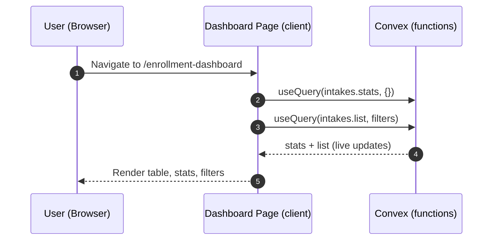
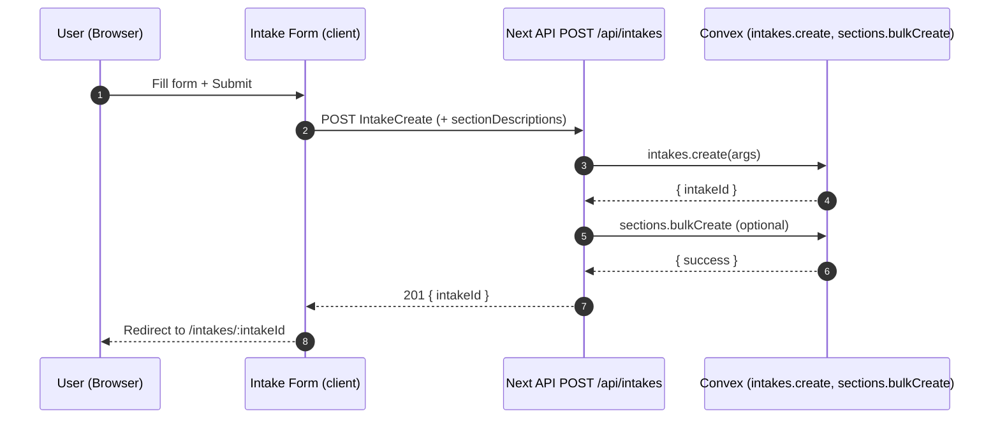
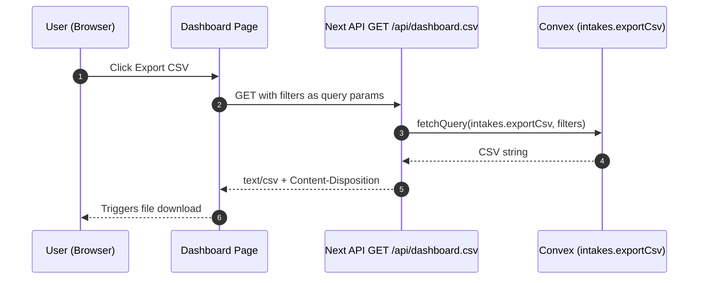
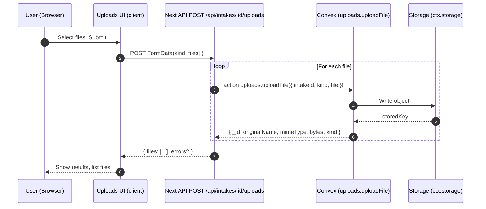

# Enrollment Dashboard — Architecture Notes (Hybrid Convex + Next.js)

**⚠️ CRITICAL: Read `TAILWIND_V4_MONOREPO_GUIDE.md` in the repo root before making ANY UI changes to avoid spacing and import issues.**

## Overview
- This app uses Convex for backend data, business logic, and storage, and Next.js (App Router) for UI and domain concerns.
- Favor Convex functions (queries, mutations, actions) for application logic; use Next.js only where Next-specific features add value.
- UI uses `density="compact"` for data-dense pages - this app is the reference implementation for compact spacing patterns.

When to use Convex
- Data access & business logic: intakes, sections, status updates, stats, CSV generation.
- File storage: upload, list, delete, and signed URLs via `ctx.storage`.
- Webhooks & public HTTP endpoints: use Convex HTTP Actions with `httpRouter`.
- Server rendering fetch: call Convex from Server Components/Actions via `fetchQuery`/`fetchMutation`/`fetchAction` (convex/nextjs).

When to use Next.js API routes
- Thin proxies for domain-specific headers (e.g., `Content-Disposition`, custom Cache-Control) if not using Convex HTTP Actions.
- Integrations with Next-only features (cookies, revalidatePath, middleware) combined with Convex calls.
- BasePath routing under `/enrollment-dashboard` when keeping URLs consistent for the app surface.

Current Hybrid Choices
- CSV export: Generated on Convex (`intakes.exportCsv`). Next route `/api/dashboard.csv` is a thin proxy returning `text/csv` + filename.
- Status update: Next route calls Convex mutation; can be replaced with direct Convex call from client if desired.
- Uploads: Handled by Next routes today; consider migrating to Convex HTTP Actions for CORS-friendly public endpoints.

Recommended Patterns
- UI (client): `useQuery` / `useMutation` for live data where appropriate.
- UI (server): SSR with `preloadQuery`/`fetchQuery`; pass token if using auth.
- Webhooks/public API: Define `convex/http.ts` with `httpRouter()` and `httpAction()`.
- Keep API surface consistent: error shape `{ error, fieldErrors? }` in routes.

Migration Notes
- Where Next routes are only proxies (no Next-specific behavior), prefer Convex HTTP Actions or direct Convex calls and remove routes.
- File uploads/downloads are good candidates to move to Convex HTTP Actions (serve/upload with proper CORS and content-type).

## Purpose & Scope
- Tracks “Enrollment Guide” intakes end-to-end: creation, status updates, section configuration, file uploads, and CSV export.
- Optimized for data-dense UI with compact spacing and shadcn/ui primitives from the shared `@repo/ui` package.

## Architecture (High level)
- UI: Next.js App Router under `basePath` `/enrollment-dashboard`.
- Backend: Convex functions in `packages/backend/convex` (queried via `convex/react` on the client and `convex/nextjs` or `ConvexHttpClient` on the server).
- Hybrid boundary: Next.js API routes are used only as thin wrappers when we need Next-specific behavior (headers, redirects, basePath, etc.). Most logic lives in Convex.

## Data Flow (Key examples)
- Dashboard (client):
  - Fetches live data via `useQuery(api.functions.intakes.stats)` and `useQuery(api.functions.intakes.list, filters)`.
  - Sorting/filtering passed to Convex; global search applied client-side for convenience.
- CSV Export (server):
  - Next route `GET /api/dashboard.csv` parses filters → `fetchQuery(api.functions.intakes.exportCsv)` → returns `text/csv` with filename headers.
- Intake Create (server):
  - Next route validates with Zod (`apps/enrollment-dashboard/src/lib/schemas.ts`) then calls `api.functions.intakes.create` and (optionally) `sections.bulkCreate`.
- Status Update, Section Flags/Upsert, Uploads (server):
  - Thin Next routes call Convex mutations/actions and enforce consistent error shapes.

### Data Flow Diagrams

#### Dashboard Loading (Client live queries)

#### Intake Creation (Form submit → Next API → Convex)

#### CSV Export (Client → Next route → Convex → download)

#### File Uploads (FormData → Next route → Convex action → Storage)

## Monorepo & Directory Map
- App root: `apps/enrollment-dashboard`
  - UI pages: `src/app/**` (App Router)
  - Components: `src/components/**`
  - Schemas/constants/routing helpers: `src/lib/**`
  - Providers: `src/app/providers.tsx` wires `ConvexProvider` with `NEXT_PUBLIC_CONVEX_URL`.
- Shared UI: `packages/ui` (shadcn/ui components + AppShell; transpiled via Next config `transpilePackages`).
- Backend (Convex): `packages/backend/convex` (functions, utils, validators, http.ts).

## Shared UI & Styling
- Use `@repo/ui` only (do not import shadcn/ui directly). AppShell navigation is provided by `@repo/ui/components/navigation/app-nav`.
- Spacing: Prefer the shared Card density variant. This app adopts `density="compact"` for Cards, CardHeader, CardContent to achieve consistent tight spacing.
- Tailwind v4: global theme imported in `src/app/globals.css` via `@import "@repo/tailwind-config"` with the monorepo rule in the Tailwind guide.
- See also: `apps/enrollment-dashboard/COMPONENT_FIXES.md` and `packages/ui/AGENTS.md` (Card density reference).

## Patterns, Conventions, Constraints
- Error shape: API routes return `{ error, fieldErrors? }` on failure; clients surface field errors inline.
- Base path: Keep URLs under `/enrollment-dashboard`. Use helpers in `src/lib/routing.ts` (`withBase`, `stripBasePath`).
- Validation: Use Zod schemas from `src/lib/schemas.ts` on the client and stricter validators in `packages/backend/convex/validators/shared.ts` on the server.
- Types/Enums: Status, GuideType, ProductionTime, SectionCode, ComplexityBand are centralized in `src/lib/schemas.ts` and mirrored in backend validators.
- Route handlers: Next 15 typed route params use `params: Promise<...>` — follow existing patterns when adding routes.

## Backend Integration (Convex)
- Primary functions: `intakes.create|get|list|updateStatus|updateSectionFlags|stats|deleteIntake|exportCsv`, `sections.upsert|bulkCreate|deleteByIntake`, `uploads.uploadFile|getDownloadUrl|deleteUpload`.
- HTTP Actions: `packages/backend/convex/http.ts` exists; future work may migrate thin Next routes (uploads/CSV) to Convex HTTP Actions.
- Storage: Uploads use `ctx.storage`; deletions cascade via Convex action.
- Client wiring: `Providers` creates a `ConvexReactClient` with `NEXT_PUBLIC_CONVEX_URL` and wraps the app in `ConvexProvider`.

## Build & Deployment
- Next config: `basePath: "/enrollment-dashboard"`, `transpilePackages: ["@repo/ui", "@repo/backend"]`.
- Vercel: `vercel.json` uses Convex deploy wrapper to inject `NEXT_PUBLIC_CONVEX_URL` and deploy backend before building the app:
  - `npx convex deploy --cmd 'pnpm build' --cmd-url-env-var-name NEXT_PUBLIC_CONVEX_URL`
  - Requires `CONVEX_DEPLOY_KEY` in the Vercel project settings.
- Local dev:
  - `pnpm install`
  - Start Convex dev in `packages/backend`: `pnpm --filter @repo/backend exec npx convex dev` (copy the URL to `.env.local` as `NEXT_PUBLIC_CONVEX_URL`).
  - Run app: `pnpm --filter enrollment-dashboard dev`.

## Recent Changes & Gotchas
- Communications Add‑Ons: Frontend is a Checkbox multi‑select with only `OE Letter`, `OE Presentation`, and `Other` (which reveals/stores custom text). `None`/`Both` are legacy. Backend includes a migration (`packages/backend/convex/scripts/migrate_comms_add_ons.ts`) and accepts the new array format.
- Density: Replaced ad‑hoc spacing with `density="compact"` across Cards and headers/contents; see COMPONENT_FIXES.md.
- CSV export now generated server‑side in Convex and streamed via a thin Next route.

## When to Move Logic
- If a Next route is a pure proxy without Next-specific concerns, prefer:
  - Direct Convex calls from the client (for authenticated, non-sensitive reads), or
  - Convex HTTP Actions (for public downloads/uploads/webhooks) and remove the Next route to reduce duplication.
